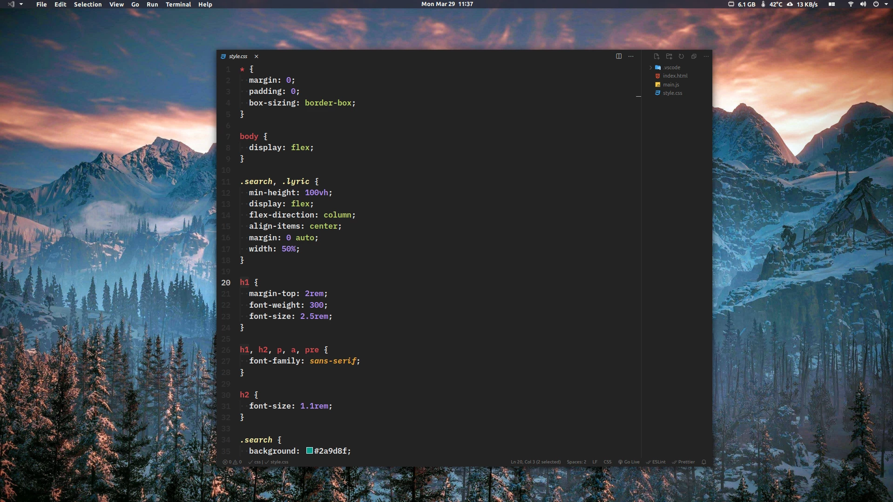
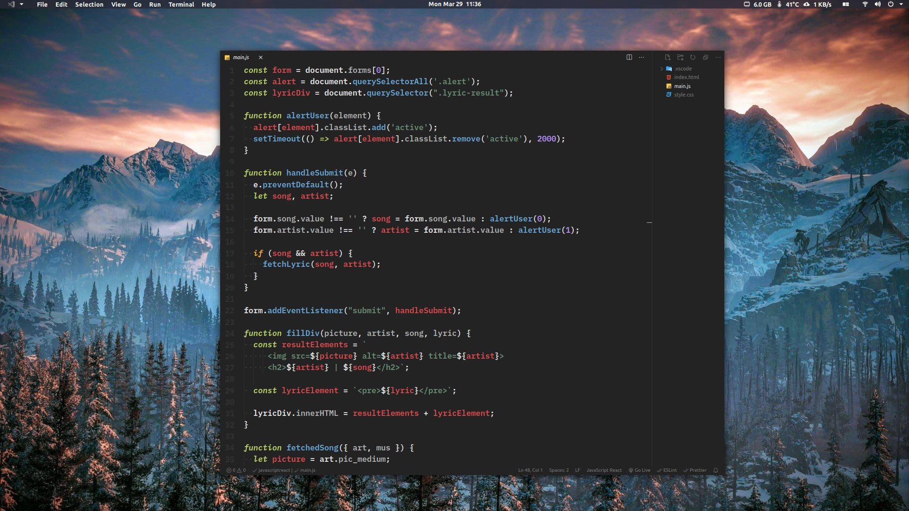
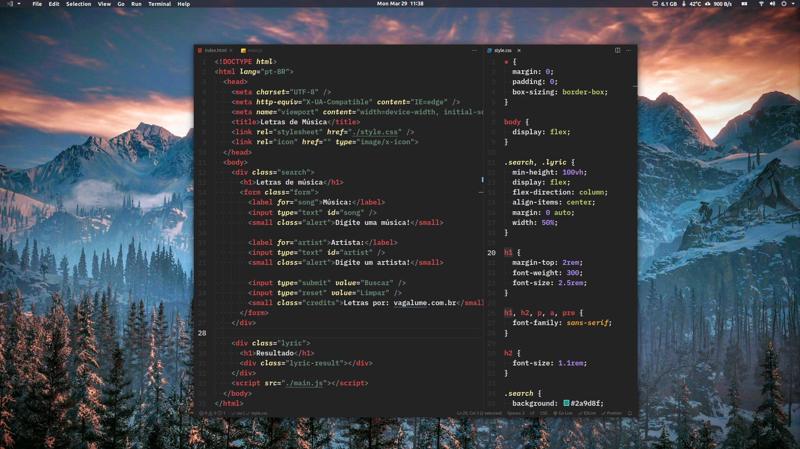

# Ad Astra Theme for VS Code
> *Under construction, basically works with HTML, CSS and JS*

## Ad Astra was created on a restlessness of mine. Of using and quickly being tired on other themes.

[Prototype on Figma](https://www.figma.com/file/fMuAe8BgnxMj9wzmBjFqGk/Ad-Astra-VSCode-Theme?node-id=0%3A1)

### Installation
Clone the repository and copy to '.vscode/extensions/' on your user folder.

### Screenshots

#### Some recommendations to a minimalist editor

    "window.zoomLevel": -1, // Zoom out the entire vs code window, can control with ctrl + '+' or '-'
    "editor.fontFamily": "IBM Plex Mono Semibold", // This one have the best italic style!
    "editor.fontSize": 20,
    "editor.lineHeight": 29,
    "editor.glyphMargin": false, // Turn off Debug bar
    "editor.minimap.enabled": false,
    "breadcrumbs.enabled": false, // Turn off the location bar below the opened tabs
    "window.titleSeparator": " | ",
    "window.title": "${dirty}${activeEditorShort}${separator}${rootName}${separator}",
    "workbench.activityBar.visible": false, // Need to know the shortcuts to see the sidebar
    "workbench.sideBar.location": "right",
    "window.menuBarVisibility": "toggle", // Just press 'alt' to see the menu bar
  
  As you can see in the screenshots, I don't use the title bar, this is a feature from Pop Os(Linux Distro) with 'Pop Shell' Activated, that have a setting to turn off every title bar.
